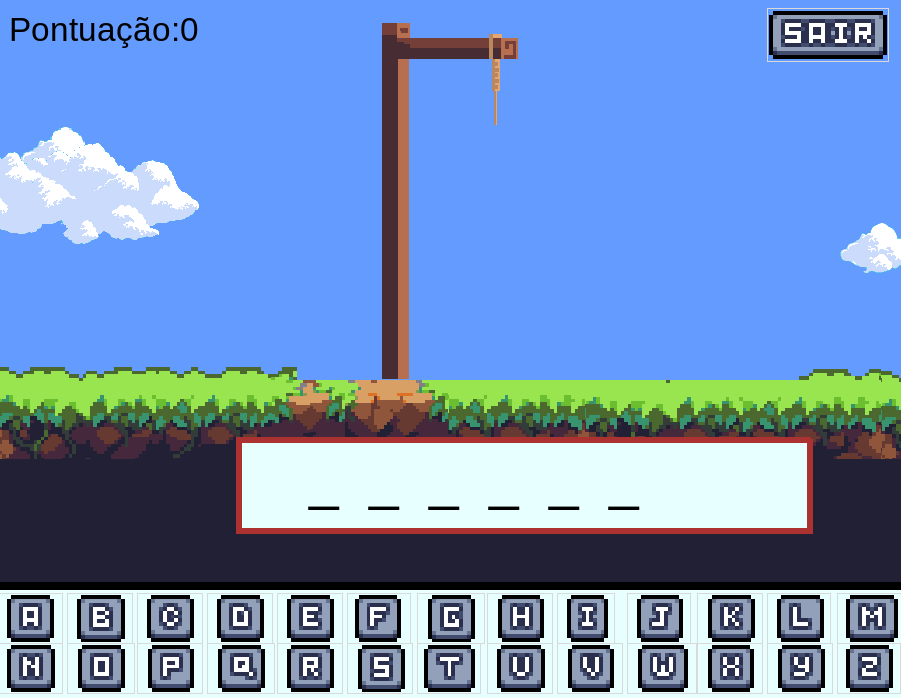
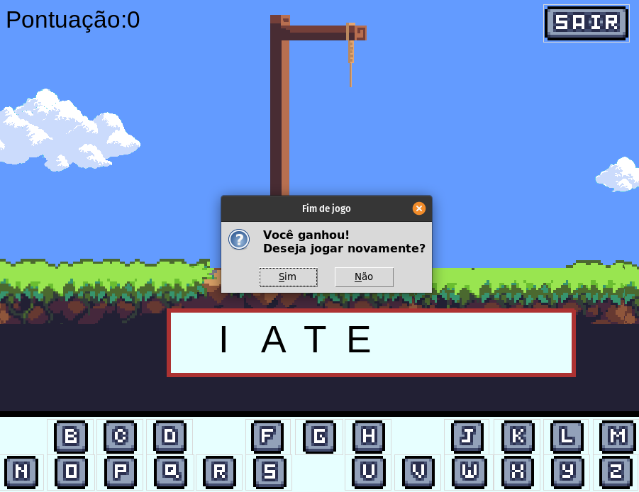
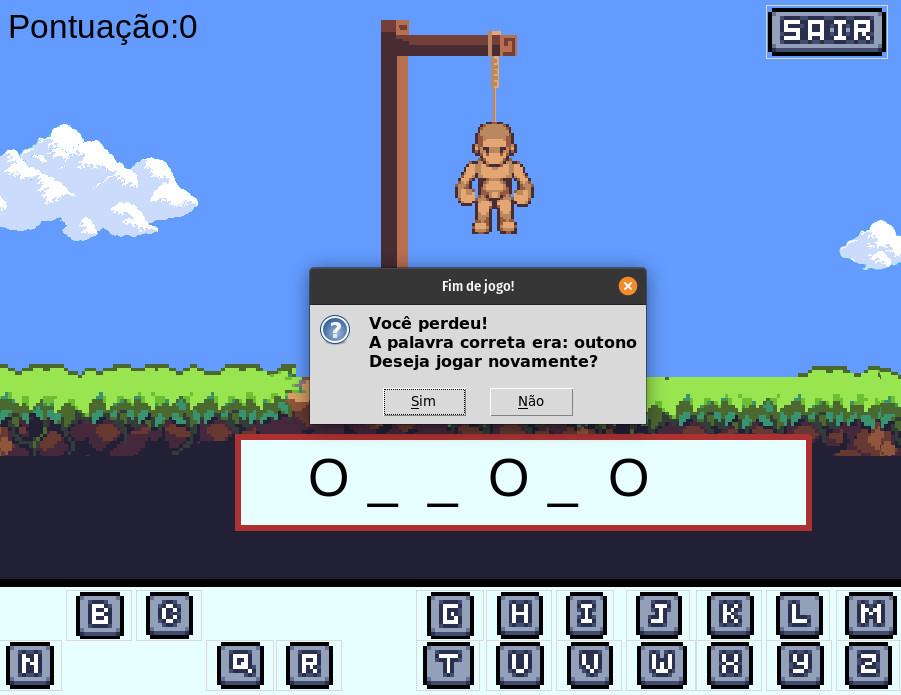

# JOGO DA FORCA

Irface gráfica para um jogo da forca feito em python.

<h1 align="center"> 
	

    🎮  FORCA  🎮

</🎮>
</h1>

## 🛠 Features

- [x] Mias de cem palavras diferentes;
- [x] Sistema de pontos;
- [x] Interface gráfica;

## 🛠 Tecnologias e Programas Utilizados

- [PyCharm](https://www.jetbrains.com/pt-br/pycharm/)
- [Python](https://www.python.org/)
- [LibreSprite](https://libresprite.github.io/#!/)

  

## 📝 Licença

Este projeto é livre.
Agradecimentos especiais à [En3rypt](https://github.com/en3rypt)

Feito por Pedro Henrique - 2022 [Entre em contato!](https://www.linkedin.com/in/pedro-henrique-88a810186/)
